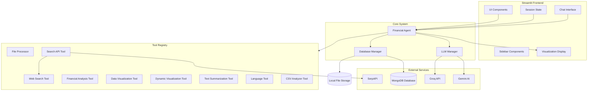
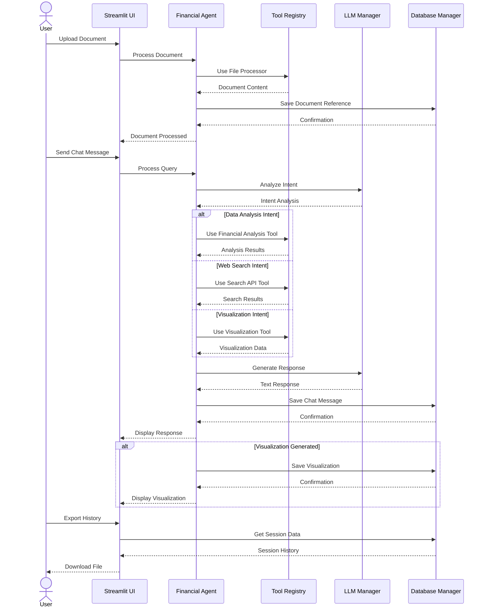
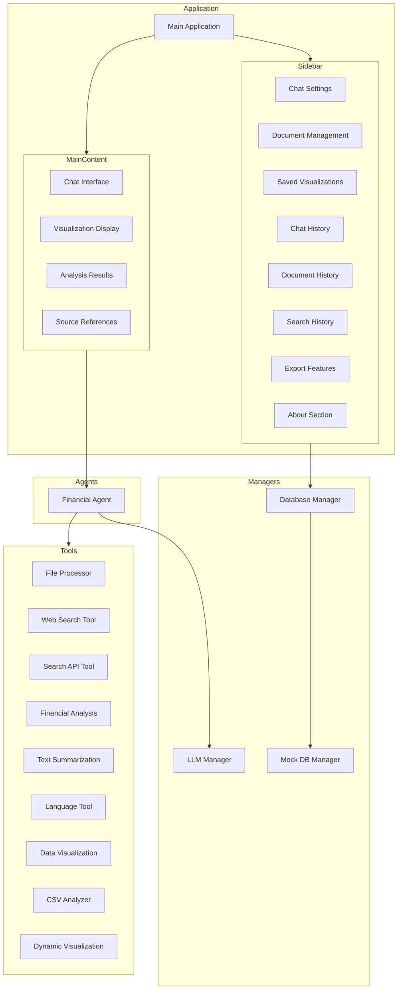
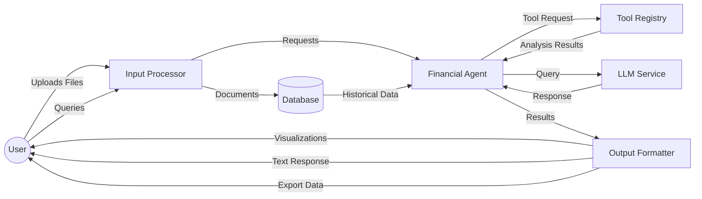

# FinWise System Architecture Diagrams

## System Architecture Diagram



## Block Diagram

```mermaid
flowchart TD
    subgraph "UI Layer"
        S[Streamlit Application]
        S --> |User Inputs| SB[Sidebar]
        S --> |Displays| CH[Chat History]
        S --> |Shows| VD[Visualization Display]
        S --> |Fixed Bottom| CI[Chat Input]
    end

    subgraph "Business Logic Layer"
        FA[Financial Agent] --> |Handles| QP[Query Processing]
        FA --> |Manages| DH[Document Handling]
        FA --> |Controls| TR[Tool Registry]
        LM[LLM Manager] --> |Manages| MP[Model Providers]
        LM --> |Handles| FR[Fallbacks]
    end

    subgraph "Data Layer"
        DB[Database Manager] --> |Stores| CM[Chat Messages]
        DB --> |Manages| VZ[Visualizations]
        DB --> |Catalogs| DR[Document References]
        DB --> |Tracks| SH[Search History]
        DB --> |Uses| MDB[(MongoDB)]
        DB --> |Fallback| MFS[Mock File Storage]
    end

    subgraph "Tool Layer"
        TR --> FP[File Processor]
        TR --> WS[Web Search]
        TR --> SA[Search API]
        TR --> FA2[Financial Analysis]
        TR --> DVT[Data Visualization]
        TR --> TS[Text Summarization]
        TR --> LT[Language Translation]
        TR --> CA[CSV Analysis]
    end

    S --> FA
    FA --> LM
    FA --> DB
    
    class "UI Layer","Business Logic Layer","Data Layer","Tool Layer" cluster
```

## Workflow Diagram



## Component Hierarchy



## Data Flow Diagram



## Feature Breakdown Structure

```mermaid
graph TD
    FinWise[FinWise Financial Chatbot] --> DataAnalysis[Data Analysis]
    FinWise --> WebResearch[Web Research]
    FinWise --> InterfaceFeatures[Interface Features]
    FinWise --> Export[Export & History]
    
    DataAnalysis --> FA1[CSV/Excel Analysis]
    DataAnalysis --> FA2[PDF Analysis]
    DataAnalysis --> FA3[Trend Detection]
    DataAnalysis --> FA4[Visualization]
    
    WebResearch --> WR1[Search API Integration]
    WebResearch --> WR2[URL Content Extraction]
    WebResearch --> WR3[Summarization]
    WebResearch --> WR4[Source Citation]
    
    InterfaceFeatures --> IF1[Chat Interface]
    InterfaceFeatures --> IF2[Document Management]
    InterfaceFeatures --> IF3[Visualization Display]
    InterfaceFeatures --> IF4[Language Translation]
    
    Export --> EX1[Chat History Export]
    Export --> EX2[Document History Tracking]
    Export --> EX3[Activity Reports]
    Export --> EX4[Full Session Archive]
    
    class FinWise,DataAnalysis,WebResearch,InterfaceFeatures,Export feature
``` 

